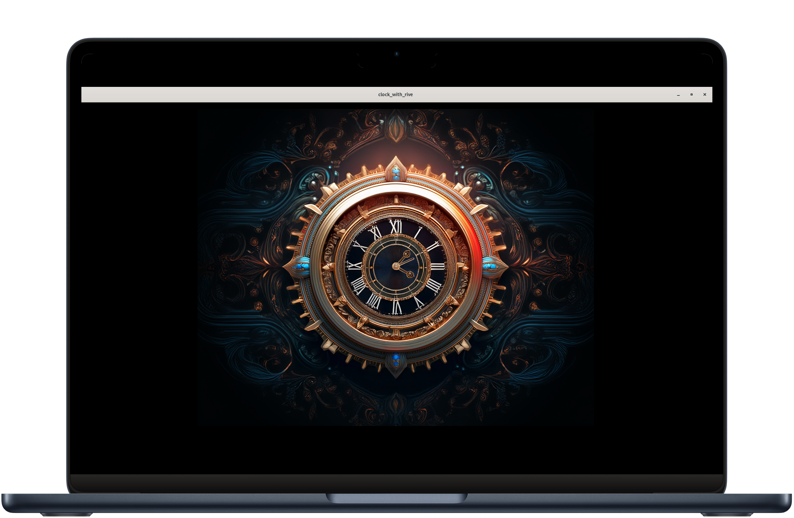

# Clock with Rive
## Test project to learn how to integrete rive with flutter

### Notes
- Load asset
```final file = await RiveFile.asset('assets/clock_clock.riv');```
- access mainArtBoard 
```final artboard = file.mainArtboard;```
- build your controller
```final controller = StateMachineController.fromArtboard(artboard,'State Machine 1',);```
- add controller to your artboard
```artboard.addController(controller!);```
- if you need to edit in any input in board 
    - first find this input
    ```final _amountInputhr = controller.findInput<double>('hr');```
    - then edit in thier value 
    ```_amountInputhr?.value = 7;```
- then pass this art bourd that edit ti rive widget to show
```setState(() => _riveArtboard = artboard);```
```Rive(artboard: _riveArtboard!)```


### App UI
